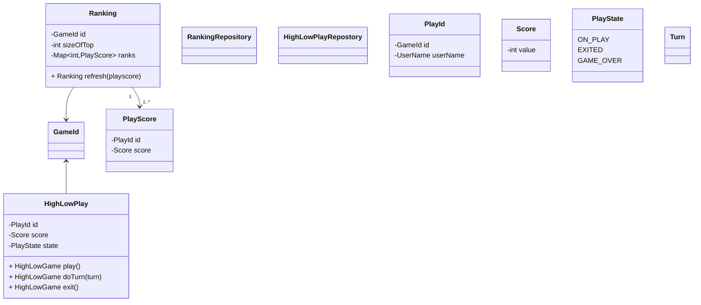

# Games 

## User Stories

- 사용자는 게임목록을 확인한다. 
- 사용자는 게임을 시작한다. 
- 사용자는 게임을 종료 한다.
- 시용자는 자신의 플레이 스코어를 확인한다.
- 사용자들의 스코어에 따라 랭킹을 확인 할 수 있다. 

## Questions
- 언제 스코어를 확인하나?
  - 게임 중에 확인 할 수 있다.
  - 게임이 끝나고 최종 스코어를 확인 할 수 있다.
- 스코어를 결정하는 기준은?
  - 야구게임의 경우에는 턴의 수가 작으면 작을 수록 스코어가 높아진다. 
  - 턴수와 무관하게 빨리 맞추면 스코어가 높다.
  - 스코어와 스코어 정책이 나뉜다. 
  
- Web Page 가 새로고침 될 때 플레이는 어떻게 처리되나? 

- 어떤 게임들이 있나?
  - highlow
  - baseball
  
## Events

1. 하이로우 게임이 시작되었다.
2. 하이로우 게임이 종료되었다.
3. 하이로우 턴을 실행했다.

## 어떤 상태가 변하는가?

1. 하이로우 게임이 시작되었다.
    - Target Value 가 설정 된다.
        - Target Value 란 맞추어야하는 숫자를 의미한다.
        - Game 이 만들어질때 값은 무엇인가?
    - Score 가 설정된다. 초기화 된다.  
    - 게임의 상태가 시작으로(Started) 변경된다. 
2. 하이로우 게임이 종료되었다. 
    - 게임의 상태가 종료로(Ended) 변경된다.
3. 하이로우 Turn 을 실행 했다.
  - Turn 이란 예상하는 숫자를 맞추는 단계 
  - Score 가 변경된다.
  - 게임의 상태가 종료로(Ended) 변경 될 수도 있다.

## 누가 관심을 가지나?  

1. 하이로우 게임이 시작되었다.
   - 아무도 관심 없다. 
2. 하이로우 게임이 종료되었다.
    - `랭킹설정`에서 관심을 가진다.
    - `랭킹설정` 에서는 종료된 게임의 스코어를 기존 스코어와 비교해 랭킹을 갱신한다. 
3. 하이로우 턴을 실행했다.
    - 아무도 관심 없다.

    

## Baseball Game

## TODO
- 난이도 조절 
- 게임오버 조건 설정 
  - 제한 시간
  - 제한 턴 

- 야구게임 추가 
- 오목게임 추가 
