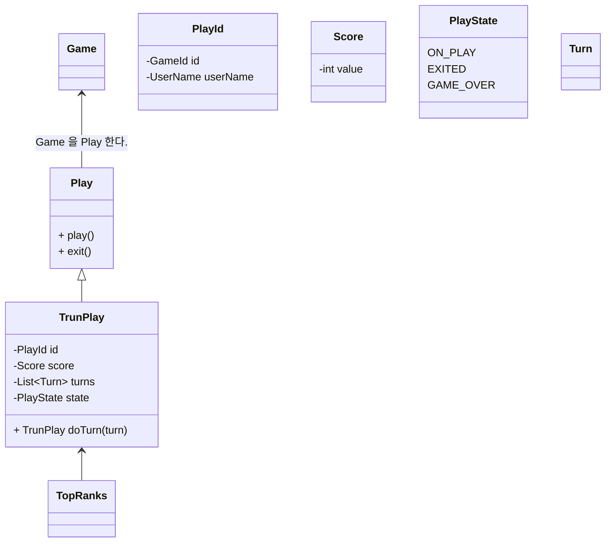

# Games 

## User Stories

- 사용자는 게임목록을 확인한다. 
- 사용자는 게임을 시작한다. 
- 사용자는 게임을 종료 한다.
- 시용자는 자신의 플레이 스코어를 확인한다.
- 사용자들의 스코어에 따라 랭킹을 확인 할 수 있다. 

## Questions
- 언제 스코어를 확인하나?
  - 게임 중에 확인 할 수 있다.
  - 게임이 끝나고 최종 스코어를 확인 할 수 있다.
- 스코어를 결정하는 기준은?
  - 야구게임의 경우에는 턴의 수가 작으면 작을 수록 스코어가 높아진다. 
  - 턴수와 무관하게 빨리 맞추면 스코어가 높다.
  - 스코어와 스코어 정책이 나뉜다. 
  
- Web Page 가 새로고침 될 때 플레이는 어떻게 처리되나? 

## Baseball Game

## TODO